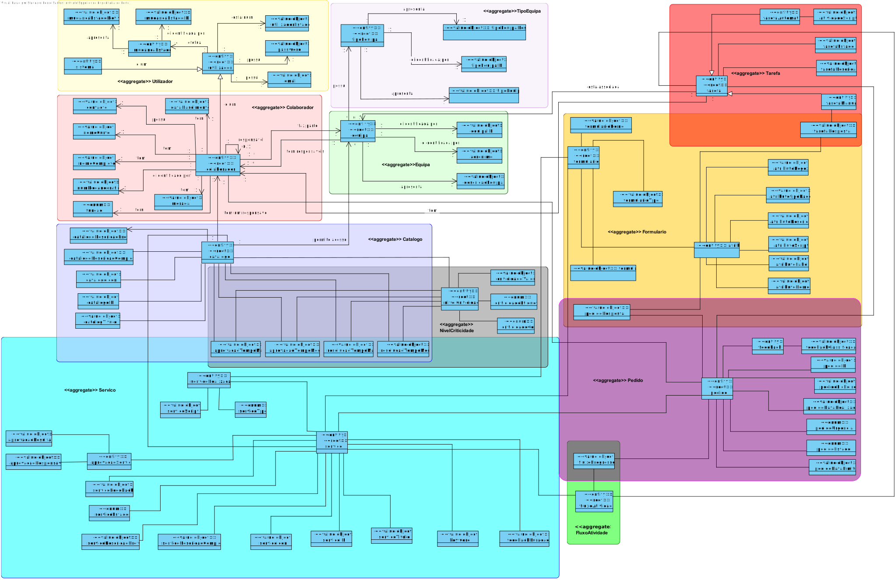

Projeto Integrador LEI 2020-2021 2DI-G03
===========================================
# 1. Team members #
  * 1190424 - Beatriz Seixas
  * 1190682 - Jessica Alves
  * 1190967 - Pedro Santos
  * 1191460 - Tiago Costa

# 2. Sprints #
  * [Sprint A](doc/sprintA/)

### Modelo de domínio:

#### Glossário:
- Atividade: corresponde a um conjunto de ações/passos executados num dado momento por algo
(e.g. sistema) ou alguém (e.g. colaborador) com vista à concretização de um determinado
objetivo.
- Atividade Automática: corresponde a uma atividade em que as ações envolvidas são executadas
sem a intervenção de um ator humano, i.e., são executadas por/através de um sistema.
- Atividade Manual: corresponde a uma atividade em que as ações envolvidas são executadas por
um ator humano.
- Catálogo de Serviços: forma através da qual se organiza os serviços disponibilizados pelo sistema
e a partir da qual se determina o público-alvo desses serviços, i.e., quem pode requer os mesmos.
- Colaborador: pessoa que independentemente do vínculo contratual que possui com a organização
que usufrui do sistema colabora/coopera com a mesma na persecução dos seus objetivos.
- Equipa: corresponde a um conjunto de colaboradores que num dado contexto pretende-se que
sejam vistos/considerados/mencionados como um grupo;
- Fluxo de atividades (em sentido lato): corresponde a um conjunto de atividades devidamente
organizadas através de mecanismos de controlo/decisão e que dessa forma estipula uma ou mais
sequências alternativas pelas quais essas atividades devem ser executadas com vista à
concretização de um objetivo. Normalmente, um fluxo de atividade compreende atividades
executados por diferentes atores e potencialmente espaçadas no tempo.
- Fluxo de atividades (em sentido restrito): corresponde a um conjunto e sequência de, no máximo,
duas atividades – uma de aprovação (opcional) e outra de resolução que será executada apenas
e só após uma decisão favorável de aprovação caso esta seja requerida.
- Organização: termo genérico para nos referirmos a uma empresa e/ou instituição que usufrui do
sistema a desenvolver.
- Pedido: resulta do ato de um colaborador requerer um determinado serviço e que desencadeia a
realização das atividades previstas e em conformidade com o fluxo de atividades especificado no
respetivo serviço.
- Serviço: corresponde a uma descrição de algo que pode ser requerido por um colaborador,
especificando, também, a informação necessária à requisição do mesmo e os procedimentos (i.e.
fluxo de atividades) subjacentes à aprovação e satisfação do mesmo quando requerido.
- SLA: acrónimo de “Service Level Agreement” que significa acordo de nível de serviço.
- Solicitação: termo utilizado como alternativa e sentido semelhante a “Pedido”.
- Tarefa: termo utilizado como alternativa e sentido semelhante a “Atividade”.
- Ticket: termo utilizado como alternativa e sentido semelhante a “Pedido”.
- Tipo de Atividade: termo utilizado para qualificar uma atividade com base em quem executa a
mesma: tipo “manual” para tarefas executada por pessoas e tipo “automática” para tarefas a
realizar pelo sistema;
- Tipo de Solicitação: expressão utilizado como alternativa e sentido semelhante a “Serviço”.
- Workflow: termo inglês utilizado como alternativa e sentido semelhante a “Fluxo de Atividades”.
