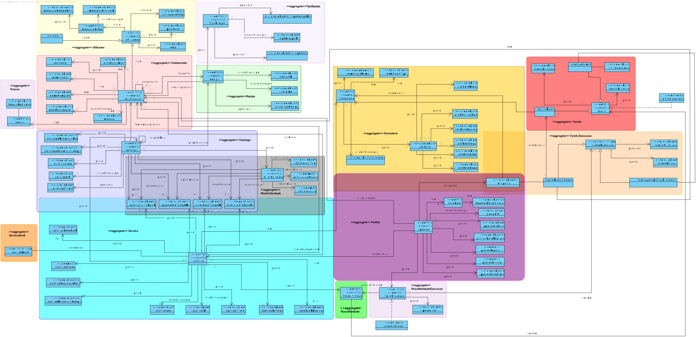

Projeto Integrador LEI 2020-2021 2DI-G03
===========================================

# 1. Modelo de domínio:#

# 2. Personna #
    * Gestor de Serviços de Helpdesk
    * Responsável de Recursos Humanos
    * Utilizador
    * Administrador

# 3. Casos de Uso #

## 2.1. Área de Gestão de Serviços e de Recursos Humanos ##

    * Como um Gestor de Serviços de Helpdesk, pretendo definir um tipo de equipa
    * Como um Gestor de Serviços de Helpdesk, pretendo definir funções
    * Como um Gestor de Serviços de Helpdesk, pretendo definir uma equipa
    * Como um Gestor de Serviços de Helpdesk, pretendo criar catálogo de serviços
    * Como um Gestor de Serviços de Helpdesk, pretendo aceitar uma especificação de um serviço
    * Como um Gestor de Serviços de Helpdesk, pretendo definir níveis de criticidade aplicados na organizaçãoem SLAs
    * Como um Gestor de Serviços de Helpdesk, pretendo associar um nível de criticidade a catálogo de serviço
    * Como um Gestor de Serviços de Helpdesk, pretendo especificar um serviço manualmente
    * Como um Gestor de Serviços de Helpdesk, pretendo especificar um serviço através de um script automático
    * Como um Gestor de Serviços de Helpdesk, pretendo consultar os serviços cuja especificação está incompleta
    * Como um Gestor de Serviços de Helpdesk, pretendo consultar os serviços de um determinado catálogo
    * Como um Gestor de Serviços de Helpdesk, pretendo consultar quais os catálogos existentes
    * Como um Gestor de Serviços de Helpdesk, pretendo consultar para um dado período de tempo, o (in)cumprimento do SLA das solicitações recebidas e já concluídas
    * Como um Gestor de Serviços de Helpdesk, pretendo consultar informação estatística sobre o estado de execução das solicitações em aprovação e/ou resolução
    * Como um Gestor de Serviços de Helpdesk, pretendo consultar os membros de uma determinada equipa
    * Como um Responsável de Recursos Humanos, pretendo especificar um colaborador manualmente
    * Como um Responsável de Recursos Humanos, pretendo especificar um colaborador através de um ficheiro .csv
    * Como um Utilizador, pretendo aceitar uma especificação de um serviço
    * Como um Utilizador, pretendo rejeitar uma especificação de um serviço

## 2.2. Área de Trabalho dos Utilizadores ##

    * Como um Utilizador, pretendo consultar/pesquisar os catálogos de serviços e respetivos serviços
    * Como um Utilizador, pretendo solicitar um serviço
    * Como um Utilizador, pretendo consultar estado dos pedidos
    * Como um Utilizador, pretendo dar feedback sobre resolução de solicitação realizada
    * Como um Utilizador, pretendo realizar uma tarefa pendente no âmbito de um pedido
    * Como um Utilizador, pretendo consultar toda a informação disponível até ao momento no pedido em causa
    * Como um Utilizador, pretendo realizar algo fora do controlo do sistema em desenvolvimento
    * Como um Utilizador, pretendo responder/completar o formulário associada à respetiva tarefa, caso exista
    * Como um Utilizador, pretendo dar a tarefa por concluída, devendo o sistema garantir que os dados do formulário que foi respondido são todos válidos
    * Como um Utilizador, pretendo consultar as minhas tarefas pendentes
    * Como um Utilizador, pretendo consultar as tarefas pendentes que posso reivindicar para realizar
    * Como um Utilizador, pretendo reivindicar realização de uma tarefa pendente
    * Como um Utilizador, pretendo exibir dashboard com tarefas pendentes

## 2.3. Área de Gestão e Execução de Fluxos ##

    * Como um Gestor de Serviços de Helpdesk, pretendo avançar fluxo de atividade de um pedido
    * Como um Gestor de Serviços de Helpdesk, pretendo adicionar componente de especificação de fluxos ao sistema
    * Como um Gestor de Serviços de Helpdesk, pretendo monitorizar e disponibilizar um resumo de informação sobre os processos pendentes
    * Como um Gestor de Serviços de Helpdesk, pretendo monitorizar e disponibilizar informação para construção de dashboard do utilizador
    * O sistema executa atividade automática

## 2.4. Área de Administração ##

    * Como um Utilizador, pretendo aceder ao sistema/aplicação portal, autentificando-me através do meu email e da minha password (login)
    * Como um Utilizador, pretendo terminar a minha sessão no sistema/aplicação portal (logout)
    * Como um Utilizador, pretendo atualizar a minha informação de colaborador
    * Como um Utilizador, pretendo dar reset à minha password
    * Como um Administrador, pretendo ativar um utilizador
    * Como um Administrador, pretendo desativar um utilizador
    * Como um Administrador, pretendo listar utilizadores

