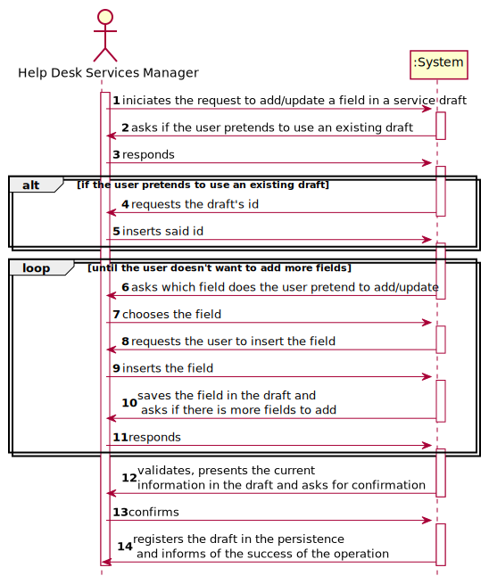
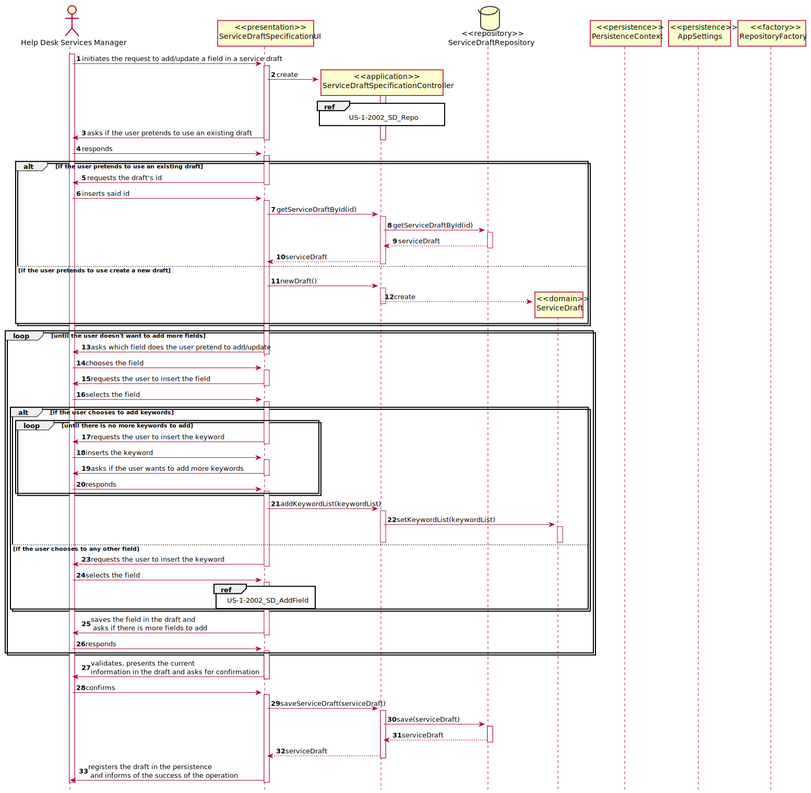
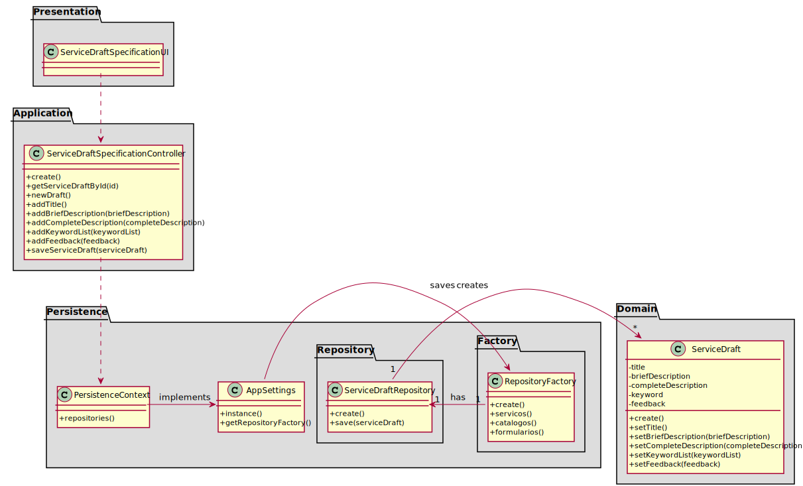

# [US-1-2002] Especificar Servico
=======================================

# 1. Requisitos

*Nesta secção a equipa deve indicar a funcionalidade desenvolvida bem como descrever a 
sua interpretação sobre a mesma e sua correlação e/ou dependência de/com outros requisitos.*

**[US-1-2002]** Como Gestor de Serviços de Helpdesk, eu pretendo proceder à especificação de 
um novo serviço, devendo o sistema permitir que a mesma fique incompleta e seja, posteriomente, retomada.

- Demo1.1. Blá Blá Blá ...

- Demo1.2. Blá Blá Blá ...

A interpretação feita deste requisito foi no sentido do gestor de serviços especificar um serviço, 
juntamente com todas as suas informações necessárias como por exemplo: código, descrição, catálogo 
onde será disponibilizado, formulários, requer feedback.

### Formato Breve

O ator envia um pedido para especificar um serviço. O sistema solicita a introdução de dados (descrição breve
 e completa). O ator introduz os dados. O sistema pergunta se o serviço requer feedback. O ator seleciona se
  pretende ou não feedback neste serviço. O sistema solicita a duração máxima permitida para o feedback.
  O ator introduz a duração máxima. O sistema mostra a lista de catálogos e solicita
a escolha de um catálogo. O ator escolhe o catálogo onde será disponibilizado o serviço. O sistema solicita
a introdução de dados do formulário (código, nome, tipo). O ator introduz os dados. O sistema solicita a 
introdução de dados (tipo de dados, regex, descrição, script, label, nome). O ator introduz os dados.
O sistema pergunta se deseja adicionar mais atributos ao formulário em questão. O ator responde se pretende
ou não adicionar mais atributos. O sistema pergunta se deseja adicionar mais formulários ao serviço em questão.
O ator responde se pretende ou não adicionar mais formulários. O sistema valida, apresenta os dados do serviço 
e solicita uma confirmação. O ator confirma. O sistema regista o serviço e informa do sucesso da operação.

### Formato Completo

#### Ator principal

* Gestor de Serviços de Helpdesk

#### Partes interessadas e seus interesses

* **Gestor de Serviços de Helpdesk:** pretende especificar um serviço.

#### Pré-condições

* Existir pelo menos um catálogo no sistema.

#### Pós-condições

* A informação da especificação do serviço é registada no sistema.

#### Requisitos especiais

\-

#### Lista de Variações de Tecnologias e Dados

\-

#### Frequência de Ocorrência

\-

#### Questões em aberto

* O ator pode a qualquer momento pausar a especificação?

# 2. Análise

*Neste secção a equipa deve relatar o estudo/análise/comparação que fez com o intuito de tomar as melhores opções de design para a funcionalidade bem como aplicar diagramas/artefactos de análise adequados.*

*Recomenda-se que organize este conteúdo por subsecções.*

### Parte do Modelo de Domínio Relevante para esta User Story

# 3. Design

*Nesta secção a equipa deve descrever o design adotado para satisfazer a funcionalidade. Entre outros, a equipa deve apresentar diagrama(s) de realização da funcionalidade, diagrama(s) de classes, identificação de padrões aplicados e quais foram os principais testes especificados para validar a funcionalidade.*

*Para além das secções sugeridas, podem ser incluídas outras.*

## 3.1. Realização da Funcionalidade

*Nesta secção deve apresentar e descrever o fluxo/sequência que permite realizar a funcionalidade.*

###	Sequence Diagram

## 3.2. Diagrama de Classes

*Nesta secção deve apresentar e descrever as principais classes envolvidas na realização da funcionalidade.*

###	Class Diagram

## 3.3. Padrões Aplicados

*Nesta secção deve apresentar e explicar quais e como foram os padrões de design aplicados e as melhores práticas.*

## 3.4. Testes 
*Nesta secção deve sistematizar como os testes foram concebidos para permitir uma correta aferição da satisfação dos requisitos.*

**Teste 1:** Verificar que não é possível criar uma instância da classe Exemplo com valores nulos.

	@Test(expected = IllegalArgumentException.class)
		public void ensureNullIsNotAllowed() {
		Exemplo instance = new Exemplo(null, null);
	}

# 4. Implementação

*Nesta secção a equipa deve providenciar, se necessário, algumas evidências de que a implementação está em conformidade com o design efetuado. Para além disso, deve mencionar/descrever a existência de outros ficheiros (e.g. de configuração) relevantes e destacar commits relevantes;*

*Recomenda-se que organize este conteúdo por subsecções.*

# 5. Integração/Demonstração

*Nesta secção a equipa deve descrever os esforços realizados no sentido de integrar a funcionalidade desenvolvida com as restantes funcionalidades do sistema.*

# 6. Observações

*Nesta secção sugere-se que a equipa apresente uma perspetiva critica sobre o trabalho desenvolvido apontando, por exemplo, outras alternativas e ou trabalhos futuros relacionados.*

