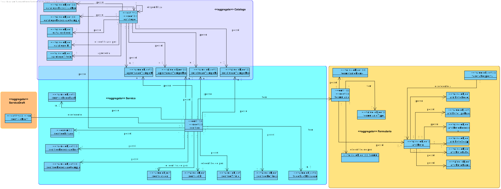
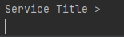
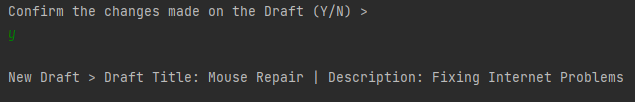

# [US-1-2002] Service Specification - Draft Field
=======================================

# 1. Requisitos

**[US-1-2002]** Como Gestor de Serviços de Helpdesk, eu pretendo proceder à especificação de 
um novo serviço, devendo o sistema permitir que a mesma fique incompleta e seja, posteriomente, retomada.

- [US-1-2002] Service Specification - Draft Field

- [US-1-2002] Service Specification - Draft Form

- [US-1-2002] Service Specification - Save Draft

A interpretação feita deste requisito foi no sentido do gestor de serviços especificar um serviço, através de um draft, 
juntamente com todas as suas informações necessárias como por exemplo: código, descrição, catálogo 
onde será disponibilizado, requer feedback e formulários (implementado em [US-1-2002] Service Specification - Draft Form)
para que este eventualmente seja guardado como um serviço (implementado em [US-1-2002] Service Specification - Save Draft).

### Formato Completo

#### Ator principal

* Gestor de Serviços de Helpdesk

#### Partes interessadas e seus interesses

* **Gestor de Serviços de Helpdesk:** pretende especificar adicionar um(uns) campo(s) a um draft de serviço.

#### Pré-condições

\-

#### Pós-condições

* A informação do campo(s) adicionado(s) é guardada no draft e registada na base e dados.

#### Requisitos especiais

\-

#### Lista de Variações de Tecnologias e Dados

\-

#### Frequência de Ocorrência

\-

#### Questões em aberto

\-

# 2. Análise

### Parte do Modelo de Domínio Relevante para esta User Story

# 3. Design

## 3.1. Realização da Funcionalidade

###	Sequence Diagram

#### Draft Field Diagram ###

#### Add Field Sub Diagram ###

## 3.2. Diagrama de Classes

###	Class Diagram

## 3.3. Padrões Aplicados

* DDD (Domain-Driven Design)

## 3.4. Testes 

**Teste Exemplo:** Verificar que é possível modificar a descrição breve de um draft. Este campo não será validado com as regras de negócio devido ao facto de ser um draft. 
Esta verificação será realizada no builder de um service. De igual forma, serão testados todos os getters e setters para cada um dos campos adicionados a um draft.

	public void testSetBriefDescription() {
        s.setBriefDescription("Ipsum");
        String real = s.getBriefDescription();
        String expected = "Ipsum";
        assertEquals(real, expected);
    }

# 4. Implementação

## 4.1. Provas de Implementação

  

  

  

  

## 4.2. Bootstrap

* Foi também desenvolvido bootstrap com o intuito de inicializar a aplicação com alguma informação, sendo services e service drafts inicializados no mesmo.

## 4.3. Commits Mais Relevantes

* Analysis: b8c23ad
* Design: eef63dc
* Implementation: f8c46b3
* Review: f787981

# 5. Integração/Demonstração

* Foram realizados esforços constantes para que todas as implementações sejam integradas da forma mais coerente, levando a que programa se apresente coeso. 
Isto foi possível através de imenso planeamento da equipa, reuniões e comunicação constantes.

# 6. Observações

## 6.1. Melhoramentos Futuros

* Permitir ao utilizador adicionar novos tipos de dados no atributo
* Permitir ao utilizador adicionar novos tipos de formulario

