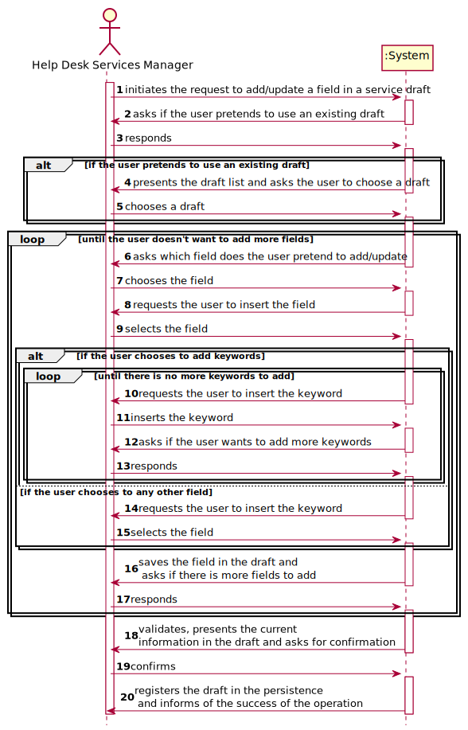
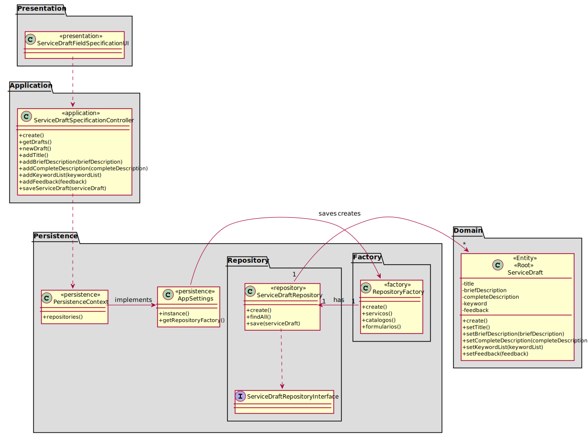

# [US-1-2002] Service Specification
=======================================

# 1. Requisitos

*Nesta secção a equipa deve indicar a funcionalidade desenvolvida bem como descrever a 
sua interpretação sobre a mesma e sua correlação e/ou dependência de/com outros requisitos.*

**[US-1-2002]** Como Gestor de Serviços de Helpdesk, eu pretendo proceder à especificação de 
um novo serviço, devendo o sistema permitir que a mesma fique incompleta e seja, posteriomente, retomada.

- Demo1.1. Blá Blá Blá ...

- Demo1.2. Blá Blá Blá ...

A interpretação feita deste requisito foi no sentido do gestor de serviços especificar um serviço, 
juntamente com todas as suas informações necessárias como por exemplo: código, descrição, catálogo 
onde será disponibilizado, formulários, requer feedback.

### Formato Completo

#### Ator principal

* Gestor de Serviços de Helpdesk

#### Partes interessadas e seus interesses

* **Gestor de Serviços de Helpdesk:** pretende especificar um serviço.

#### Pré-condições

* Existir pelo menos um catálogo no sistema.

#### Pós-condições

* A informação da especificação do serviço é registada no sistema.

#### Requisitos especiais

\-

#### Lista de Variações de Tecnologias e Dados

\-

#### Frequência de Ocorrência

\-

#### Questões em aberto

\-

# 2. Análise

### Parte do Modelo de Domínio Relevante para esta User Story

# 3. Design

## 3.1. Realização da Funcionalidade

*Nesta secção deve apresentar e descrever o fluxo/sequência que permite realizar a funcionalidade.*

###	Sequence Diagram

#### Draft Field Diagram ###

#### Add Field Sub Diagram ###

## 3.2. Diagrama de Classes

*Nesta secção deve apresentar e descrever as principais classes envolvidas na realização da funcionalidade.*

###	Class Diagram

## 3.3. Padrões Aplicados

* DDD (Domain-Driven Design)

## 3.4. Testes 

**Teste Exemplo:** Verificar que é possível modificar a descrição breve de um draft. Este campo não será validado com as regras de negócio devido ao facto de ser um draft. 
Esta verificação será realizada no builder de um service. De igual forma, serão testados todos os getters e setters para cada um dos campos adicionados a um draft.

	public void testSetBriefDescription() {
        s.setBriefDescription("Ipsum");
        String real = s.getBriefDescription();
        String expected = "Ipsum";
        assertEquals(real, expected);
    }

# 4. Implementação

*Nesta secção a equipa deve providenciar, se necessário, algumas evidências de que a implementação está em conformidade com o design efetuado. Para além disso, deve mencionar/descrever a existência de outros ficheiros (e.g. de configuração) relevantes e destacar commits relevantes;*

*Recomenda-se que organize este conteúdo por subsecções.*

## 4.1. Provas de Implementação

## 4.2. Bootstrap

* Foi também desenvolvido bootstrap com o intuito de inicializar a aplicação com alguma informação, sendo services e service drafts inicializados no mesmo.

## 4.3. Commits Mais Relevantes

* Analysis: b8c23ad
* Design: eef63dc
* Implementation: f8c46b3
* Review: f787981

# 5. Integração/Demonstração

* Foram realizados esforços constantes para que todas as implementações sejam integradas da forma mais coerente, levando a que programa se apresente coeso. 
Isto foi possível através de imenso planeamento da equipa, reuniões e comunicação constantes.

# 6. Observações

## 6.1. Melhoramentos Futuros

* Permitir ao utilizador adicionar novos tipos de dados no atributo
* Permitir ao utilizador adicionar novos tipos de formulario

