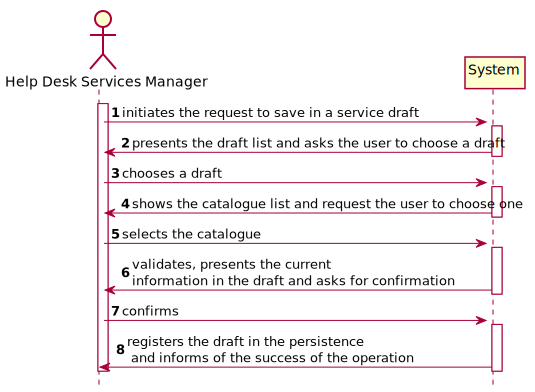
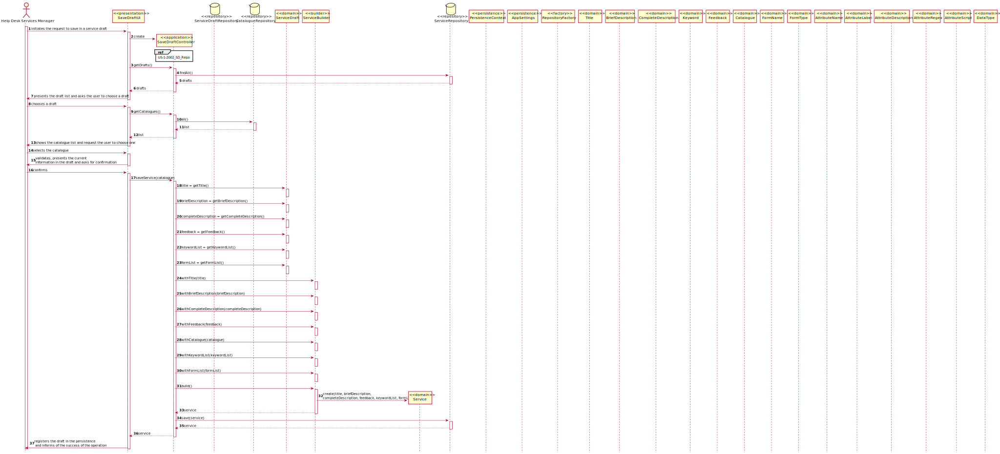
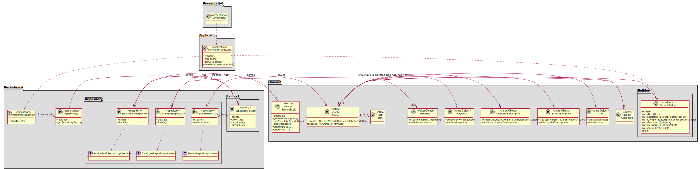
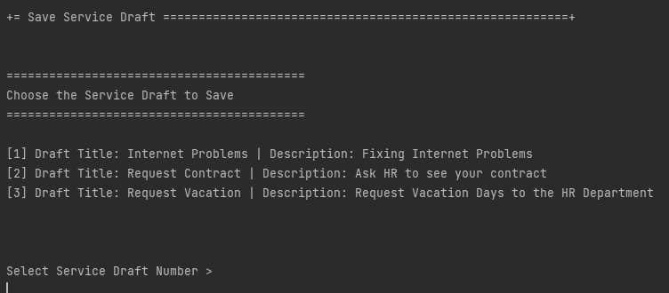
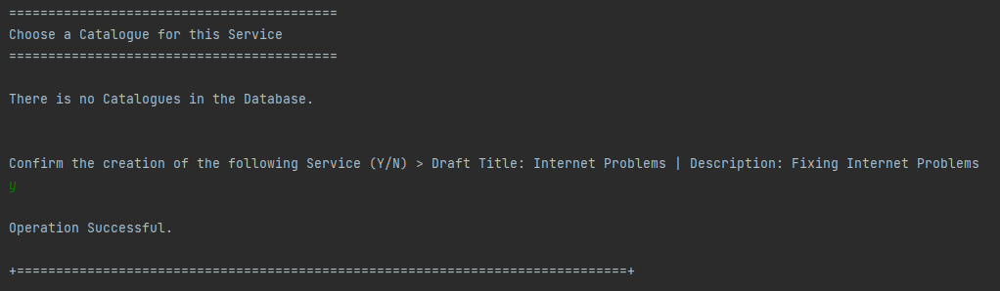

# [US-1-2002] Service Specification - Save Draft
=======================================

# 1. Requisitos

**[US-1-2002]** Como Gestor de Serviços de Helpdesk, eu pretendo proceder à especificação de 
um novo serviço, devendo o sistema permitir que a mesma fique incompleta e seja, posteriomente, retomada.

- [US-1-2002] Service Specification - Draft Field

- [US-1-2002] Service Specification - Draft Form

- [US-1-2002] Service Specification - Save Draft

A interpretação feita deste requisito foi no sentido do gestor de serviços guardar um draft previamente preenchido no entuito de o guardar como servico na base de dados.
É apenas nesta instância que todos os campos são verificados de acordo com as regras de negócio, permitindo assim que a informação dos drafts sejam totalmente livre.

### Formato Completo

#### Ator principal

* Gestor de Serviços de Helpdesk

#### Partes interessadas e seus interesses

* **Gestor de Serviços de Helpdesk:** pretende guardar um draft como um serviço na base de dados.

#### Pré-condições

* Existir drafts e catálogos na base de dados

#### Pós-condições

* A informação do formulário(s) adicionado(s) é guardada no serviço e registada na base e dados.

#### Requisitos especiais

\-

#### Lista de Variações de Tecnologias e Dados

\-

#### Frequência de Ocorrência

\-

#### Questões em aberto

\-

# 2. Análise

### Parte do Modelo de Domínio Relevante para esta User Story

# 3. Design

## 3.1. Realização da Funcionalidade

###	Sequence Diagram

## 3.2. Diagrama de Classes

###	Class Diagram

## 3.3. Padrões Aplicados

* DDD (Domain-Driven Design)

## 3.4. Testes 

**Teste Exemplo:** Testar o builder desenvolvidos para o servico de forma a que todas as regras de negócio sejam verificadas e, após estes serem criados, 
verificar se a lista de keywords está corretamente adicionada e apresentada no serviço.

	public static Service getDummyService(final String strTitle, final String strBriefDescription, final String strCompleteDescription,
                                              final Double dblFeedback, Catalogue oCatalogue, final List<String> lstKeywords, final List<Form> lstForms) {
        ServiceBuilder serviceBuilder = new ServiceBuilder();
        serviceBuilder = serviceBuilder.withTitle(strTitle);
        serviceBuilder = serviceBuilder.withBriefDescription(strBriefDescription);
        serviceBuilder = serviceBuilder.withCompleteDescription(strCompleteDescription);
        serviceBuilder = serviceBuilder.withFeedback(dblFeedback);
        serviceBuilder = serviceBuilder.withCatalogue(oCatalogue);
        serviceBuilder = serviceBuilder.withKeywordList(lstKeywords);
        serviceBuilder = serviceBuilder.withFormList(lstForms);
        return serviceBuilder.build();
    }
	
	public void testKeywords() {
        List<Keyword> real = s.keywords();
        List<Keyword> expected = new ArrayList<>(Arrays.asList(new Keyword("Ipsum")));
        assertEquals(real, expected);
    }

# 4. Implementação

## 4.1. Provas de Implementação

  

  

## 4.2. Bootstrap

* Foi também desenvolvido bootstrap com o intuito de inicializar a aplicação com alguma informação, sendo services e service drafts inicializados no mesmo.

## 4.3. Commits Mais Relevantes

* Analysis: b8c23ad
* Design: eef63dc
* Implementation: f8c46b3
* Review: f787981

# 5. Integração/Demonstração

* Foram realizados esforços constantes para que todas as implementações sejam integradas da forma mais coerente, levando a que programa se apresente coeso. 
Isto foi possível através de imenso planeamento da equipa, reuniões e comunicação constantes.

# 6. Observações

## 6.1. Melhoramentos Futuros

* Permitir ao utilizador adicionar novos tipos de dados no atributo
* Permitir ao utilizador adicionar novos tipos de formulario

