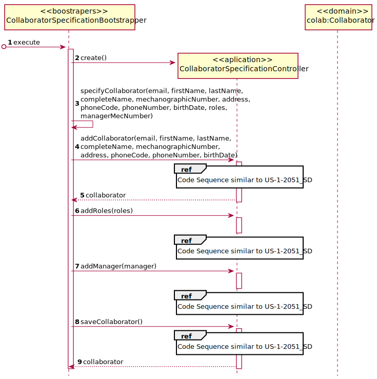
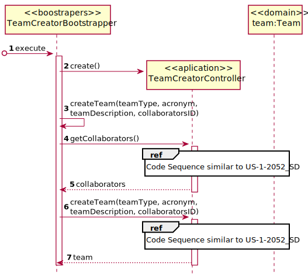
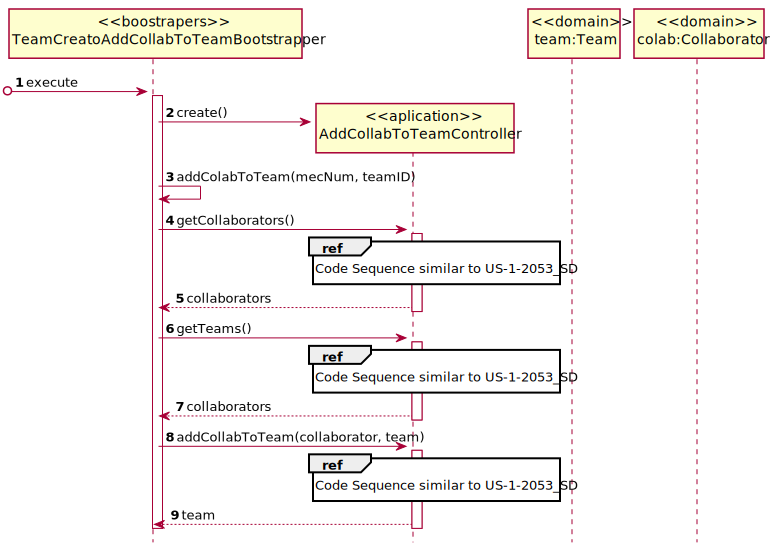

# [US-1-2103] Organization Bootstrap
=======================================

# 1. Requisitos

**[US-1-2103]** Como Gestor de Projeto, eu pretendo que, para efeitos de demonstração,
o sistema contemple a possibilidade de ser inicializado (bootstrap) com alguma informação
relativa à estrutura orgânica da organização.

- [US-1-2103] Services Bootstrap

A interpretação feita deste requisito foi no sentido de melhorar a apresentação
da aplicação, sendo introduzido previamente valores referentes à estrutura orgânica da organização.

### Formato Completo

#### Ator principal

* Gestor de Projeto

#### Partes interessadas e seus interesses

* **Gestor de Projeto:** pretende o sistema seja inicializado com informação

#### Pré-condições

\-

#### Pós-condições

* A informação referente à estrutura orgânica da organização é registada na base e dados.

#### Requisitos especiais

\-

#### Lista de Variações de Tecnologias e Dados

\-

#### Frequência de Ocorrência

\-

#### Questões em aberto

\-

# 2. Design

## 2.1. Realização da Funcionalidade

###	Sequence Diagram

#### Collaborator Specification

#### CreateTeam

#### Add Collaborator To Team

## 2.2. Padrões Aplicados

* DDD (Domain-Driven Design)

# 3. Implementação

## 3.1. Provas de Implementação

## 3.2. Commits Mais Relevantes

* Analysis: dcda5ef
* Design: d77a886
* Implementation: 8742dfd
* Review: f3decee

# 4. Integração/Demonstração

* Foram realizados esforços constantes para que todas as implementações sejam integradas da forma mais coerente, levando a que programa se apresente coeso.
  Isto foi possível através de imenso planeamento da equipa, reuniões e comunicação constantes.

# 5. Observações

## 5.1. Melhoramentos Futuros

* Adicionar Mais Informação

