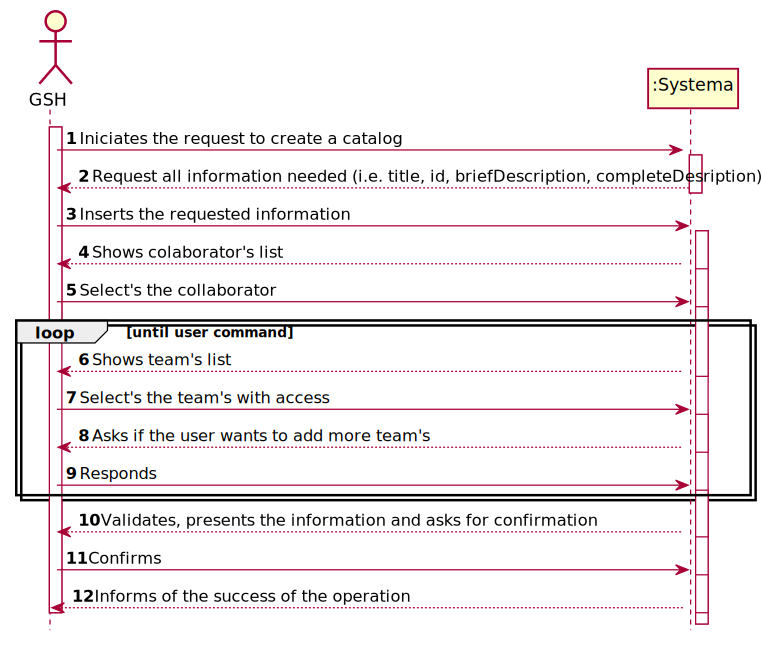
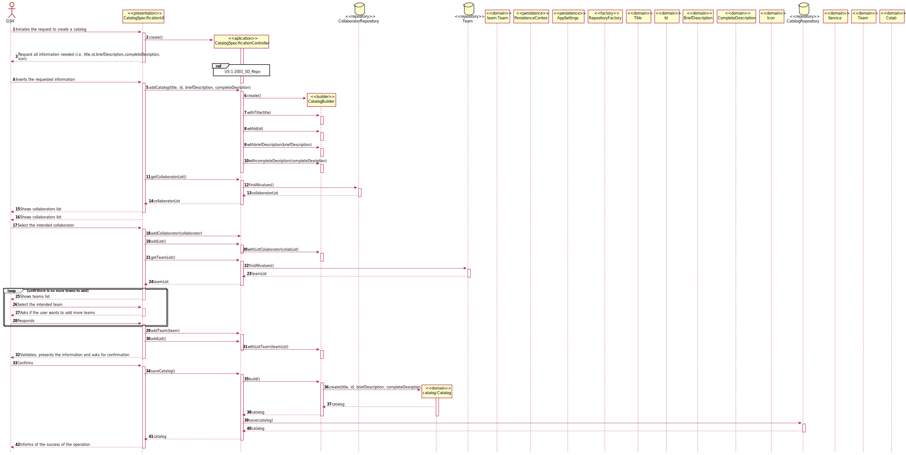

# US76 Criar Catálogo
=======================================

# 1. Requisitos

**US76** Como Gestor de Serviços de Help desk (GSH) pretendo:

- pretendo criar um novo catálogo de serviços.

A interpretação feita deste requisito foi no sentido de ...

### Formato Breve

O GSH Envia um pedido para criar um catálogo.
O Sistema solicita toda a informação necessária para a criação do catalogo(i.e. id, titulo, descBreve, descCompleta,criticidade). O GSH introduz os dados.
O Sistema mostra a lista de colaboradores e pede a ecolha do colaborador responsável.O GSH escolhe o responsável.
O Sistema mostra a lista de equipas e pede para escolher as listas com direito ao acesso ao catálogo. O GSH escolhe as equipas com acesso.
O Sistema mostra a lista dos serviços e pede para escolher os serviços que necessita. O GSH escolhe os serviços.
Apresenta a informação e solicita confirmação. Confirma.
Valida e informa do sucesso da operação.
 

### Formato Completo

#### Ator principal

* Gestor de Serviços de Help desk 

#### Partes interessadas e seus interesses

* **Gestor de Serviços de Help desk :** pretende criar um catalogo.

#### Pré-condições

\-

#### Pós-condições

* A informação da criação do catalogo é registada no sistema.

#### Requisitos especiais

\-

#### Lista de Variações de Tecnologias e Dados

\-

#### Frequência de Ocorrência

\-

#### Questões em aberto

* O ator pode a qualquer momento pausar a especificação?

# 2. Análise

*Neste secção a equipa deve relatar o estudo/análise/comparação que fez com o intuito de tomar as melhores opções de design para a funcionalidade bem como aplicar diagramas/artefactos de análise adequados.*

*Recomenda-se que organize este conteúdo por subsecções.*

### Parte do Modelo de Domínio Relevante para esta User Story

# 3. Design

*Nesta secção a equipa deve descrever o design adotado para satisfazer a funcionalidade. Entre outros, a equipa deve apresentar diagrama(s) de realização da funcionalidade, diagrama(s) de classes, identificação de padrões aplicados e quais foram os principais testes especificados para validar a funcionalidade.*

*Para além das secções sugeridas, podem ser incluídas outras.*

## 3.1. Realização da Funcionalidade

*Nesta secção deve apresentar e descrever o fluxo/sequência que permite realizar a funcionalidade.*

###	Sequence Diagram

## 3.2. Diagrama de Classes

*Nesta secção deve apresentar e descrever as principais classes envolvidas na realização da funcionalidade.*

###	Class Diagram

## 3.3. Padrões Aplicados

*Nesta secção deve apresentar e explicar quais e como foram os padrões de design aplicados e as melhores práticas.*

## 3.4. Testes 
*Nesta secção deve sistematizar como os testes foram concebidos para permitir uma correta aferição da satisfação dos requisitos.*

**Teste 1:** Verificar que não é possível criar uma instância da classe Exemplo com valores nulos.

	@Test(expected = IllegalArgumentException.class)
		public void ensureNullIsNotAllowed() {
		Exemplo instance = new Exemplo(null, null);
	}

# 4. Implementação

*Nesta secção a equipa deve providenciar, se necessário, algumas evidências de que a implementação está em conformidade com o design efetuado. Para além disso, deve mencionar/descrever a existência de outros ficheiros (e.g. de configuração) relevantes e destacar commits relevantes;*

*Recomenda-se que organize este conteúdo por subsecções.*

# 5. Integração/Demonstração

*Nesta secção a equipa deve descrever os esforços realizados no sentido de integrar a funcionalidade desenvolvida com as restantes funcionalidades do sistema.*

# 6. Observações

*Nesta secção sugere-se que a equipa apresente uma perspetiva critica sobre o trabalho desenvolvido apontando, por exemplo, outras alternativas e ou trabalhos futuros relacionados.*

