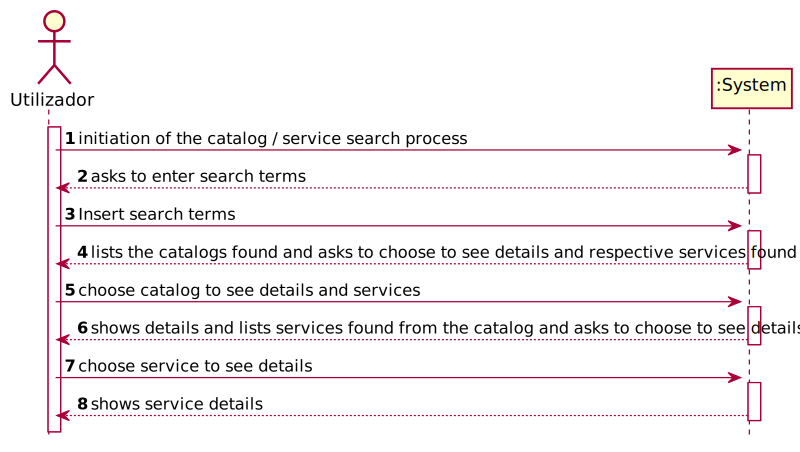

# US3001 Procurar por Serviços e Catalogos
=======================================

# 1. Requisitos

**US76** Como utilizador pretendo:

- pretendo pesquisar por catalogos e respetivos serviços.

A interpretação feita deste requisito foi no sentido de ...

### Formato Breve

O Utilizador inicia o processo de pesquisa de catálogos/serviços .
Sistema pede para introduzir os termos de pesquisa.
O utilizador digita os termos de pesquisa
O sistema lista os catálogos encontrados e pede para escolher para ver detalhes e respetivos serviços encontrados
O utilizador escolhe catálogo para ver detalhes e serviços
O sistema mostra detalhes e lista serviços encontrados do catalogo e pede para escolher para ver detalhes
O utilizador escolhe serviço para ver detalhes
O sistema mostra detalhes do serviço

### Formato Completo

#### Ator principal

* Utilizador 

#### Partes interessadas e seus interesses

* **Utilizador :** pretende pesquisar um catalogo e respetivos serviços.

#### Pré-condições

\-

#### Pós-condições

* A informação da criação do catalogo é registada no sistema.

#### Requisitos especiais

\-

#### Lista de Variações de Tecnologias e Dados

\-

#### Frequência de Ocorrência

\-

#### Questões em aberto

* O ator pode a qualquer momento pausar a pesquisa?

# 2. Análise

*Neste secção a equipa deve relatar o estudo/análise/comparação que fez com o intuito de tomar as melhores opções de design para a funcionalidade bem como aplicar diagramas/artefactos de análise adequados.*

*Recomenda-se que organize este conteúdo por subsecções.*

### Parte do Modelo de Domínio Relevante para esta User Story

# 3. Design

*Nesta secção a equipa deve descrever o design adotado para satisfazer a funcionalidade. Entre outros, a equipa deve apresentar diagrama(s) de realização da funcionalidade, diagrama(s) de classes, identificação de padrões aplicados e quais foram os principais testes especificados para validar a funcionalidade.*

*Para além das secções sugeridas, podem ser incluídas outras.*

## 3.1. Realização da Funcionalidade

*Nesta secção deve apresentar e descrever o fluxo/sequência que permite realizar a funcionalidade.*

###	Sequence Diagram

## 3.2. Diagrama de Classes

*Nesta secção deve apresentar e descrever as principais classes envolvidas na realização da funcionalidade.*

###	Class Diagram

## 3.3. Padrões Aplicados

*Nesta secção deve apresentar e explicar quais e como foram os padrões de design aplicados e as melhores práticas.*

## 3.4. Testes 
*Nesta secção deve sistematizar como os testes foram concebidos para permitir uma correta aferição da satisfação dos requisitos.*

**Teste 1:** Verificar que não é possível criar uma instância da classe Exemplo com valores nulos.

	@Test(expected = IllegalArgumentException.class)
		public void ensureNullIsNotAllowed() {
		Exemplo instance = new Exemplo(null, null);
	}

# 4. Implementação

*Nesta secção a equipa deve providenciar, se necessário, algumas evidências de que a implementação está em conformidade com o design efetuado. Para além disso, deve mencionar/descrever a existência de outros ficheiros (e.g. de configuração) relevantes e destacar commits relevantes;*

*Recomenda-se que organize este conteúdo por subsecções.*

# 5. Integração/Demonstração

*Nesta secção a equipa deve descrever os esforços realizados no sentido de integrar a funcionalidade desenvolvida com as restantes funcionalidades do sistema.*

# 6. Observações

*Nesta secção sugere-se que a equipa apresente uma perspetiva critica sobre o trabalho desenvolvido apontando, por exemplo, outras alternativas e ou trabalhos futuros relacionados.*

