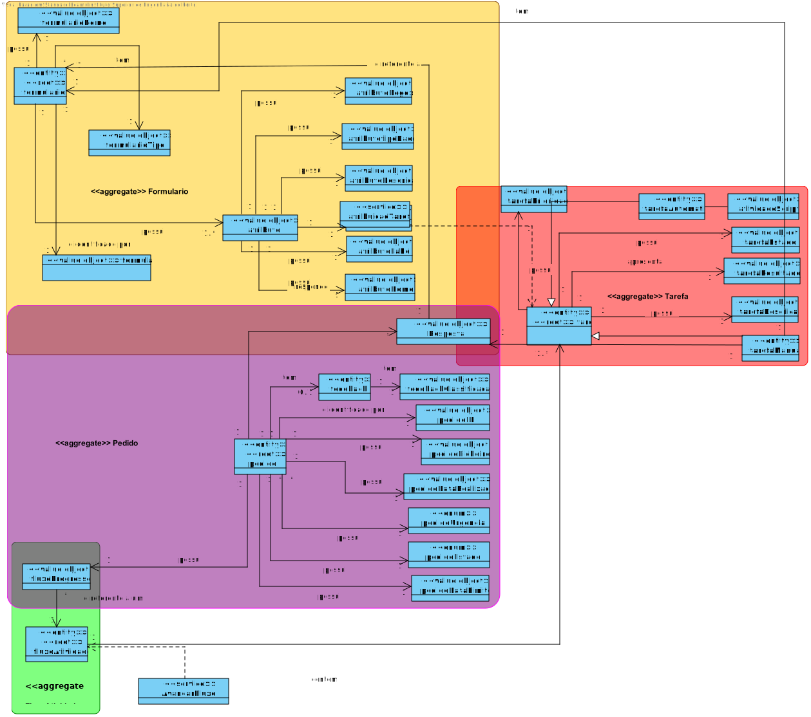
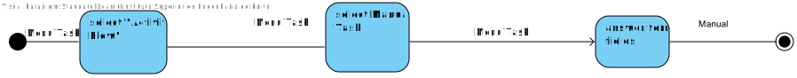

# US1005 Tarefa manual
=======================================

# 1. Requisitos

**US1005** Como Gestor de Projeto, eu pretendo que seja desenvolvida a componente representativa de uma tarefa manual dedicada à apresentação e recolha de informação a/de um utilizador no âmbito de um pedido.
A interpretação feita deste requisito foi no sentido de ...

#### Ator principal

* Como Gestor de Projeto

#### Partes interessadas e seus interesses

* **Gestor do Projeto :** pretende que seja desnvolvida a tarefa manual.

#### Pré-condições

\-

#### Pós-condições

\-
#### Requisitos especiais

\-

#### Lista de Variações de Tecnologias e Dados

\-

#### Frequência de Ocorrência

\-

#### Questões em aberto
\-
# 2. Análise

A interpretação feita deste requisito foi no sentido do gestor de projeto  realizar uma  tarefa manual,onde posteriormente irá preencher os campos necessários do formlario.

### Parte do Modelo de Domínio Relevante para esta User Story

# 3. Design

## 3.1. Realização da Funcionalidade

## 3.3. Padrões Aplicados
* DDD (Domain-Driven Design)

