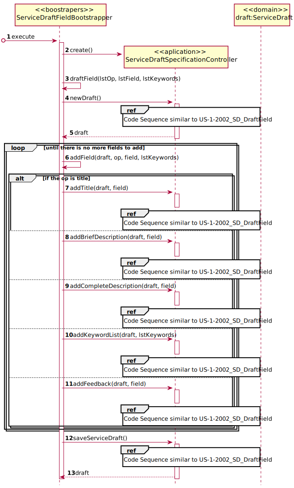
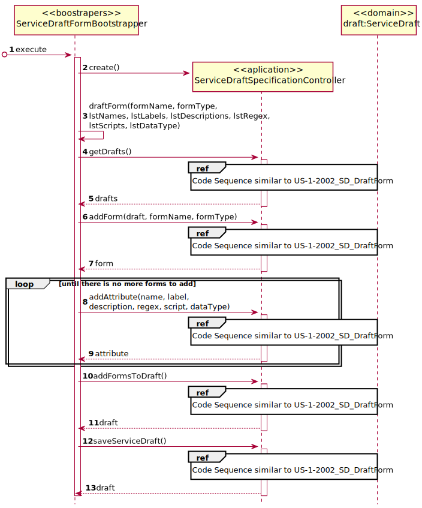
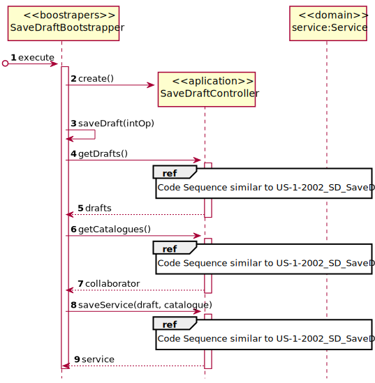

# [US-1-2104] Complete Services Bootstrap
=======================================

# 1. Requisitos

**[US-1-2104]** Como Gestor de Projeto, eu pretendo que, para efeitos de demonstração, o sistema contemple a
possibilidade de ser inicializado (bootstrap) com alguma informação relativa a serviços completamente especificados.

- [US-1-2104] Complete Services Bootstrap

A interpretação feita deste requisito foi no sentido de melhorar a apresentação
da aplicação, sendo introduzido previamente valores referentes a serviços completamente especificados.

### Formato Completo

#### Ator principal

* Gestor de Projeto

#### Partes interessadas e seus interesses

* **Gestor de Projeto:** pretende o sistema seja inicializado com informação

#### Pré-condições

\-

#### Pós-condições

* A informação referente aos serviços é registada na base e dados.

#### Requisitos especiais

\-

#### Lista de Variações de Tecnologias e Dados

\-

#### Frequência de Ocorrência

\-

#### Questões em aberto

\-

# 2. Design

## 2.1. Realização da Funcionalidade

###	Sequence Diagram

#### Draft Add Field

#### Draft Add Form

#### Save Draft

## 2.2. Padrões Aplicados

* DDD (Domain-Driven Design)

# 3. Implementação

## 3.1. Commits Mais Relevantes

* Analysis: 70c3715
* Design: 567a25e
* Implementation: ffa5b6c
* Review: a71d30f

# 4. Integração/Demonstração

* Foram realizados esforços constantes para que todas as implementações sejam integradas da forma mais coerente, levando a que programa se apresente coeso. 
Isto foi possível através de imenso planeamento da equipa, reuniões e comunicação constantes.

# 5. Observações

## 5.1. Melhoramentos Futuros
\-

