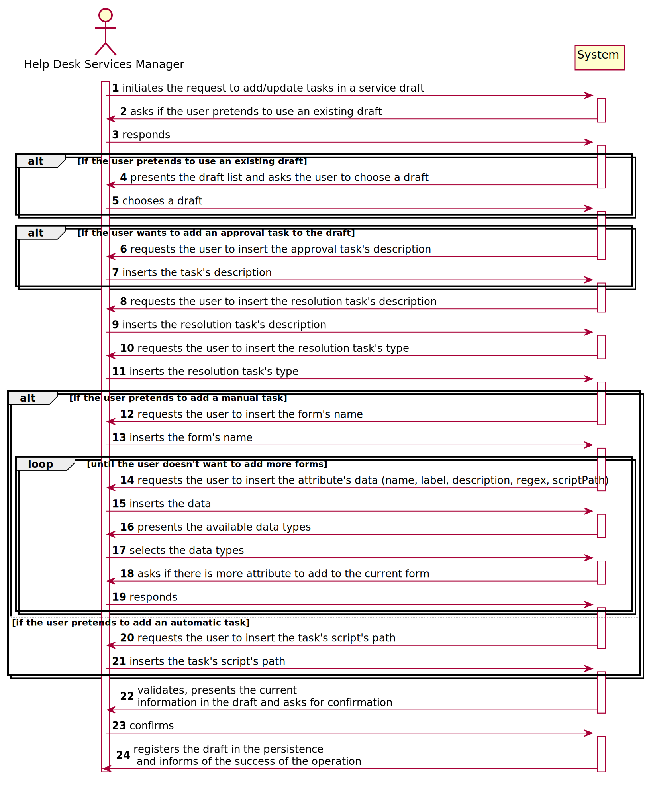
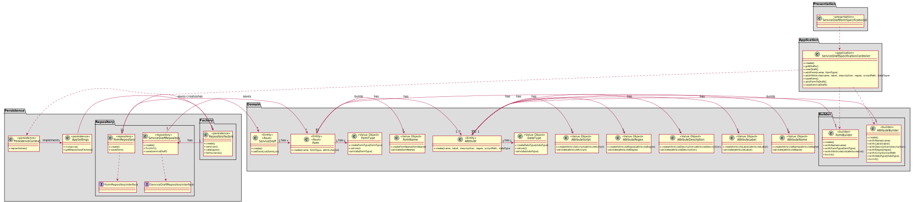

# [US-1-2002] Service Specification - Draft Form
=======================================

# 1. Requisitos

**[US-1-2002]** Como Gestor de Serviços de Helpdesk, eu pretendo proceder à especificação de 
um novo serviço, devendo o sistema permitir que a mesma fique incompleta e seja, posteriomente, retomada.

- [US-1-2002] Service Specification - Draft Field

- [US-1-2002] Service Specification - Draft Form

- [US-1-2002] Service Specification - Save Draft

A interpretação feita deste requisito foi no sentido do gestor de serviços adicionar um formulário a um draft de serviço, 
para que este eventualmente seja guardado como um serviço (implementado em [US-1-2002] Service Specification - Save Draft).

### Formato Completo

#### Ator principal

* Gestor de Serviços de Helpdesk

#### Partes interessadas e seus interesses

* **Gestor de Serviços de Helpdesk:** pretende especificar adicionar um(vários) formulário(s) a um draft de serviço.

#### Pré-condições

\-

#### Pós-condições

* A informação do formulário(s) adicionado(s) é guardada no draft e registada na base e dados.

#### Requisitos especiais

\-

#### Lista de Variações de Tecnologias e Dados

\-

#### Frequência de Ocorrência

\-

#### Questões em aberto

\-

# 2. Análise

### Parte do Modelo de Domínio Relevante para esta User Story

# 3. Design

## 3.1. Realização da Funcionalidade

###	Sequence Diagram

## 3.2. Diagrama de Classes

###	Class Diagram

## 3.3. Padrões Aplicados

* DDD (Domain-Driven Design)

## 3.4. Testes 

**Teste Exemplo:** Testar os builders desenvolvidos para o atributo e para o formulário de forma a que todas as regras de negócio sejam verificadas e, após estes serem criados, 
adicionar um lista de formulários a um draft e verificar se este guarda/apresenta a informação corretamente.

	public static Attribute getDummyAttribute(final String strName, final String strLabel, final String strDescription,
                                              final String strRegex, final String strScript, final String strDataType) {
        AttributeBuilder attributeBuilder = new AttributeBuilder();
        attributeBuilder = attributeBuilder.withName(strName);
        attributeBuilder = attributeBuilder.withLabel(strLabel);
        attributeBuilder = attributeBuilder.withDescription(strDescription);
        attributeBuilder = attributeBuilder.withRegex(strRegex);
        attributeBuilder = attributeBuilder.withScript(strScript);
        attributeBuilder = attributeBuilder.withDataType(strDataType);
        return attributeBuilder.build();
    }

    public static Form getDummyForm(final String oName, final String oFormType, final List<Attribute> lstAttributes) {
        FormBuilder formBuilder = new FormBuilder();
        formBuilder = formBuilder.withName(oName);
        formBuilder = formBuilder.withType(oFormType);
        formBuilder = formBuilder.withAttributeList(lstAttributes);
        return formBuilder.build();
    }
	
	public void testGetFormList() {
        Form real = s.getFormList().get(0);
        Form expected = f;
        assertEquals(real, expected);
    }

# 4. Implementação

## 4.1. Provas de Implementação

  

  

  

  

  

## 4.2. Bootstrap

* Foi também desenvolvido bootstrap com o intuito de inicializar a aplicação com alguma informação, sendo services e service drafts inicializados no mesmo.

## 4.3. Commits Mais Relevantes

* Analysis: b8c23ad
* Design: eef63dc
* Implementation: f8c46b3
* Review: f787981

# 5. Integração/Demonstração

* Foram realizados esforços constantes para que todas as implementações sejam integradas da forma mais coerente, levando a que programa se apresente coeso. 
Isto foi possível através de imenso planeamento da equipa, reuniões e comunicação constantes.

# 6. Observações

## 6.1. Melhoramentos Futuros

* Permitir ao utilizador adicionar novos tipos de dados no atributo
* Permitir ao utilizador adicionar novos tipos de formulario

