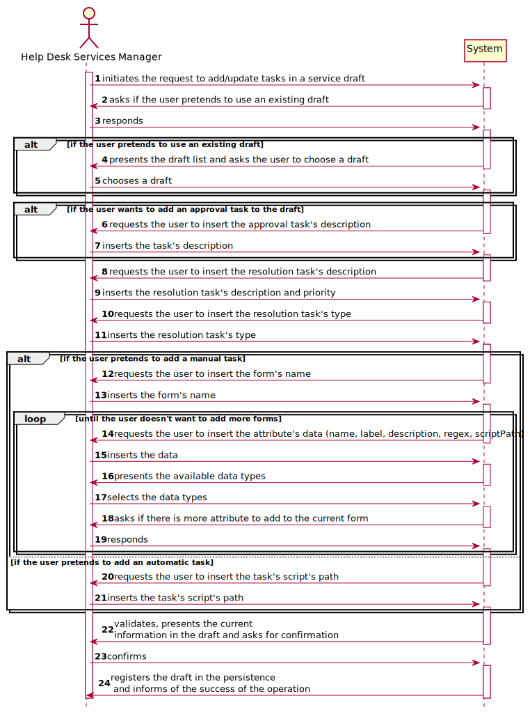
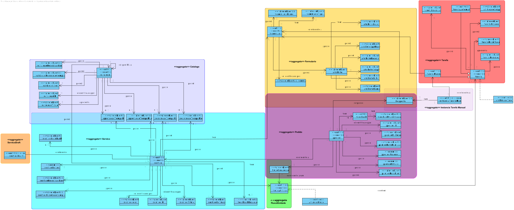
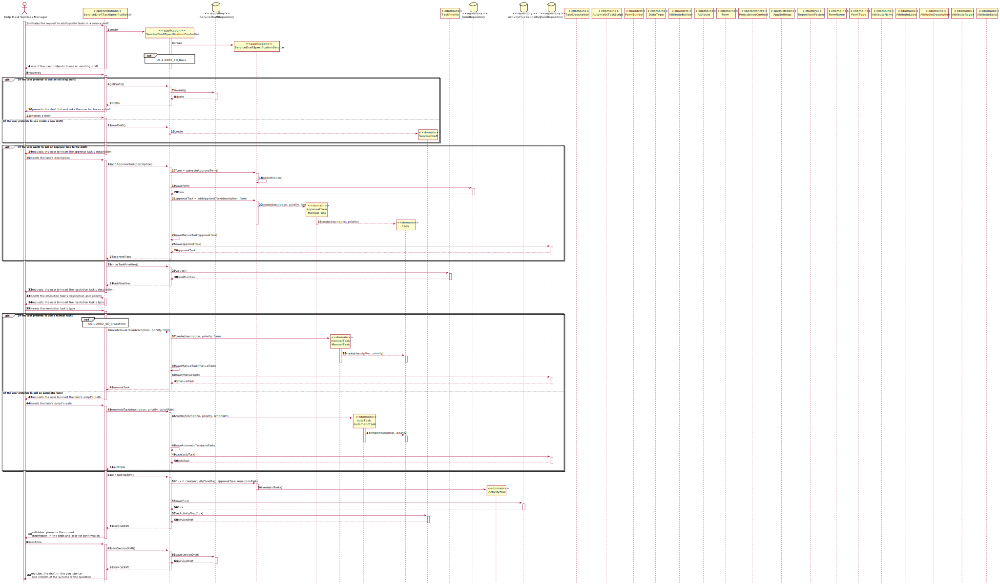
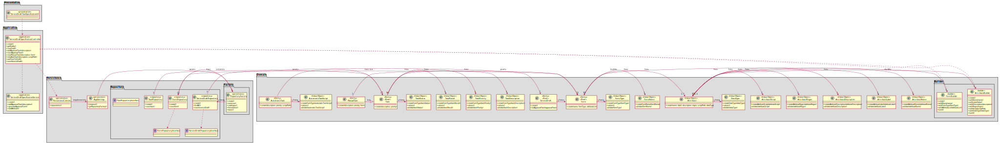

# [US-1-2003] Service Specification - Draft Task
=======================================

# 1. Requisitos

**[US-1-2003]** Como GSH, eu pretendo continuar/completar a especificação em curso de um serviço.

- [US-1-2003] Service Specification - Draft Task

A interpretação feita deste requisito foi no sentido do gestor de serviços adicionar uma task a um draft de serviço, 
para que este eventualmente seja guardado como um serviço (implementado em [US-1-2002] Service Specification - Save Draft).

### Formato Completo

#### Ator principal

* Gestor de Serviços de Helpdesk

#### Partes interessadas e seus interesses

* **Gestor de Serviços de Helpdesk:** pretende adicionar uma(várias) task(s) a um draft de serviço.

#### Pré-condições

\-

#### Pós-condições

* A informação da task(s) adicionada(s) é guardada no draft e registada na base e dados.

#### Requisitos especiais

\-

#### Lista de Variações de Tecnologias e Dados

\-

#### Frequência de Ocorrência

\-

#### Questões em aberto

\-

# 2. Análise

### Parte do Modelo de Domínio Relevante para esta User Story

# 3. Design

## 3.1. Realização da Funcionalidade

###	Sequence Diagram

## 3.2. Diagrama de Classes

###	Class Diagram

## 3.3. Padrões Aplicados

* DDD (Domain-Driven Design)

## 3.4. Testes 

TO-DO

# 4. Implementação

## 4.1. Bootstrap

* Foi também desenvolvido bootstrap com o intuito de inicializar a aplicação com alguma informação, sendo tasks e service drafts inicializados no mesmo.

## 4.2. Commits Mais Relevantes

* Analysis: 4991c27
* Design: 34822dd
* Implementation: 68ae9af
* Review: 907cfd4

# 5. Integração/Demonstração

* Foram realizados esforços constantes para que todas as implementações sejam integradas da forma mais coerente, levando a que programa se apresente coeso. 
Isto foi possível através de imenso planeamento da equipa, reuniões e comunicação constantes.

# 6. Observações

## 6.1. Melhoramentos Futuros

- Possiveis Melhoramentos à classe ActivityFlux

