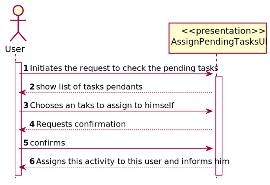
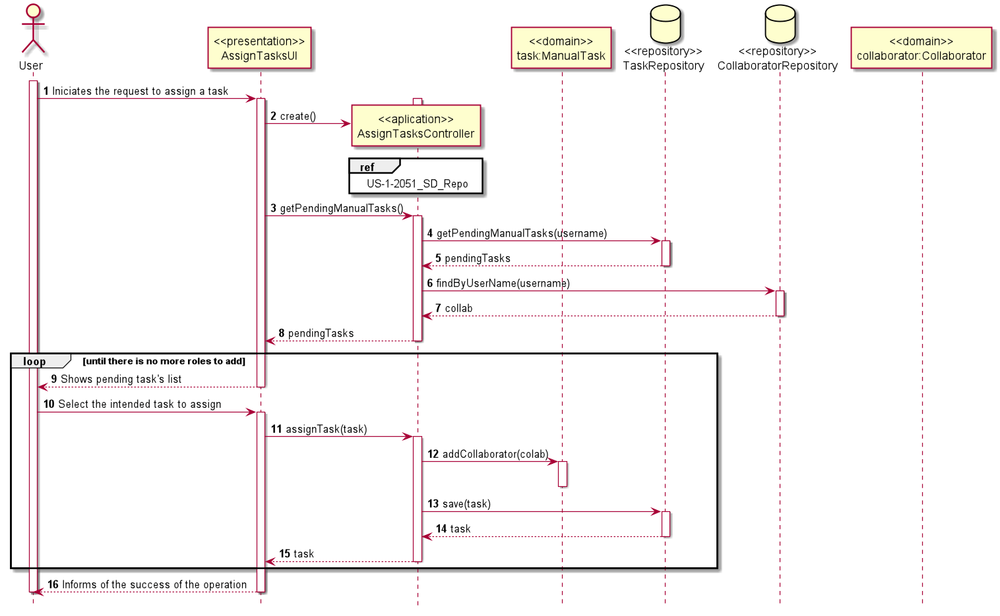
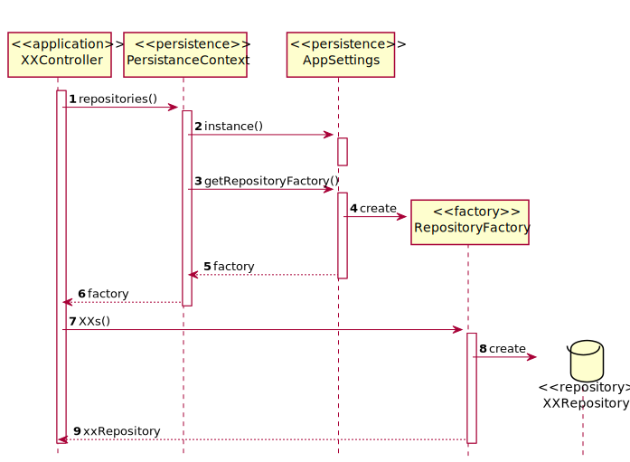

# US1005 Tarefa manual
=======================================

# 1. Requisitos

**US1005** Como utilizador, eu pretendo consultar as tarefas pendentes que eu posso reivindicar para mim e, caso o deseje, concretize essa reivindicação.

#### Ator principal

* Utilizador

#### Partes interessadas e seus interesses

* **Utilizador :** pretende que possa reivindicar tarefas para si.

#### Pré-condições

\-

#### Pós-condições

\-
#### Requisitos especiais

\-

#### Lista de Variações de Tecnologias e Dados

\-

#### Frequência de Ocorrência

\-

#### Questões em aberto
\-
# 2. Análise

 O utilizador inicia o pedido para reivindicar as tarefas para si.
 O Sistema mostra a lista das tarefas pendentes que ele tem acesso.
 O utilizador escolha a tarefa que quer revindicar.
O sistema pede confirmação e o utilizador confirma.
A tarefa é reivindicada com sucesso e o utilizador é informado.

### Parte do Modelo de Domínio Relevante para esta User Story

# 3. Design
## 3.1. Realização da Funcionalidade

###	Sequence Diagram

## 3.2. Diagrama de Classes

*Nesta secção deve apresentar e descrever as principais classes envolvidas na realização da funcionalidade.*

###	Class Diagram

## 3.3. Padrões Aplicados

* DDD (Domain-Driven Design)
