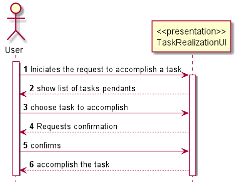
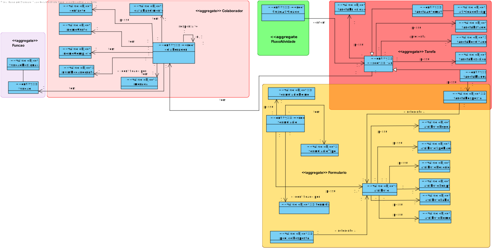
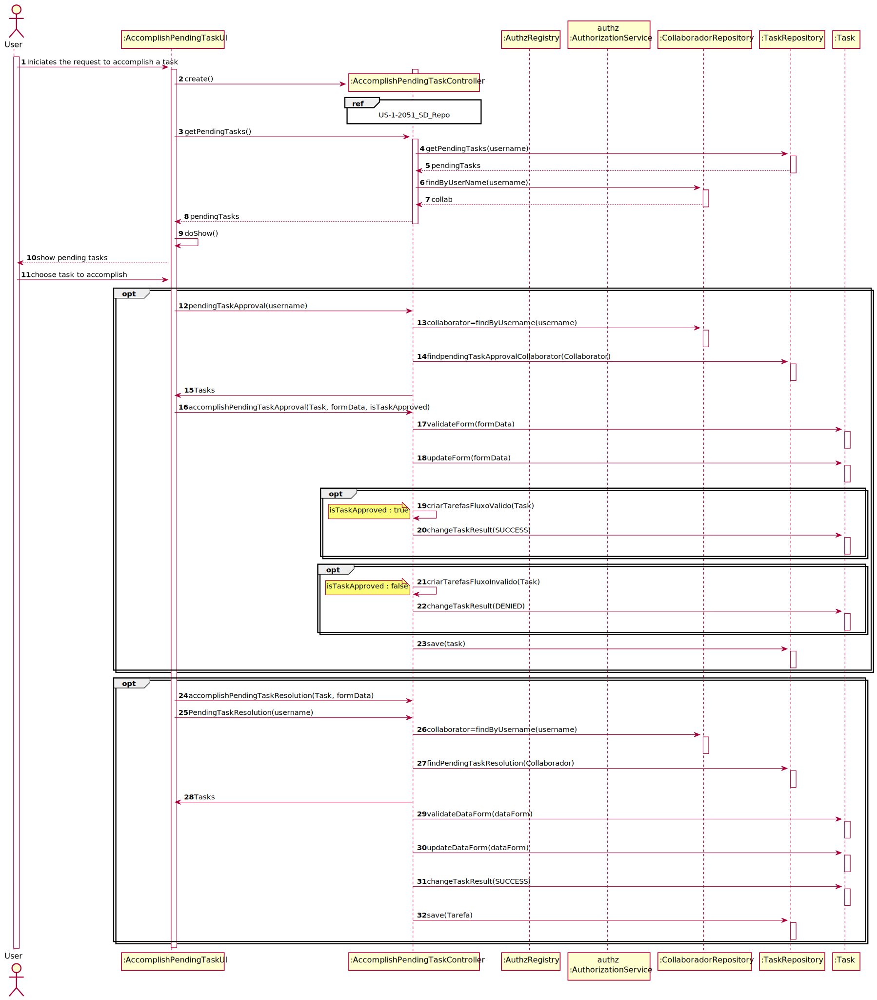

# US1005 Tarefa manual
=======================================

# 1. Requisitos

**US3023**Como utilizador, eu pretendo realizar uma tarefa que tenho como pendente.
#### Ator principal

* Utilizador

#### Partes interessadas e seus interesses

* **Utilizador :** pretendo realizar uma tarefa que tenho como pendente.

#### Pré-condições

\-

#### Pós-condições

\-
#### Requisitos especiais

\-

#### Lista de Variações de Tecnologias e Dados

\-

#### Frequência de Ocorrência

\-

#### Questões em aberto
\-
# 2. Análise
O utilizador pede realizar uma tarefa que tenho como pendente.
O sistema mostra a lista de tarefas pendentes
O utilizador escolhe uma tarefa
O sistema valida o formulario e completa a tarefa.

### Parte do Modelo de Domínio Relevante para esta User Story

# 3. Design
## 3.1. Realização da Funcionalidade

###	Sequence Diagram

## 3.2. Diagrama de Classes

*Nesta secção deve apresentar e descrever as principais classes envolvidas na realização da funcionalidade.*

###	Class Diagram

## 3.3. Padrões Aplicados

* DDD (Domain-Driven Design)
