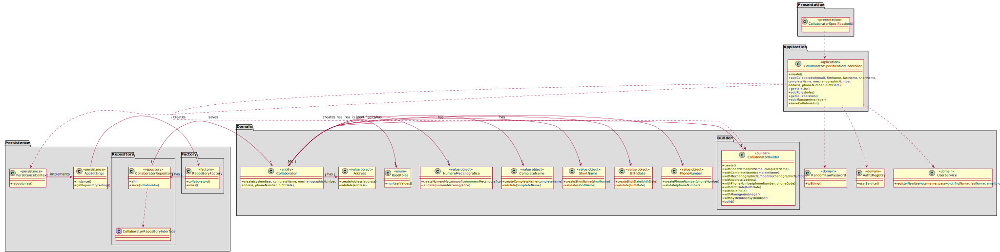

# [US-1-2051] Collaborator Specification
=======================================

# 1. Requisitos

**[US-1-2051]** Como Responsável de Recursos Humanos (RRH) pretendo proceder à especificação de um novo colaborador de modo a que este possa, posteriormente, aceder e usar o sistema.

- [US-1-2051] Collaborator Specification

A interpretação feita deste requisito foi no sentido do Responsável de Recursos Humanos especificar um colaborador
com todas as suas informações necessárias como por exemplo: email, primeiro e último nome, nome completo,número mecanográfico, morada, contacto e data de nascimento (implementado em [US-1-2051] Collaborator Specification).

### Formato Completo

#### Ator principal

* Responsável de Recursos Humanos

#### Partes interessadas e seus interesses

* **Responsável de Recursos Humanos:** pretende especificar um colaborador.

#### Pré-condições

* Existir a informação de funções no sistema.

#### Pós-condições

* A informação da especificação do colaborador é registada no sistema.

#### Requisitos especiais

\-

#### Lista de Variações de Tecnologias e Dados

\-

#### Frequência de Ocorrência

\-

#### Questões em aberto

\-

# 2. Análise

### Parte do Modelo de Domínio Relevante para esta User Story

# 3. Design

## 3.1. Realização da Funcionalidade

###	Sequence Diagram

###	Sequence Diagram Repository

## 3.2. Diagrama de Classes

###	Class Diagram

## 3.3. Padrões Aplicados

* DDD (Domain-Driven Design)

## 3.4. Testes 

**Teste Exemplo:** Verificar que é possível modificar o nome completo de um claborador.

    public void testCompleteName() {
        CollaboratorCompleteName real = c.completeName();
        String expected = "Ipsum";
        assertEquals(real.toString(), expected);
    }

# 4. Implementação

  

  

  

  

## 4.2. Bootstrap

* Foi também desenvolvido bootstrap com o intuito de inicializar a aplicação com alguma informação, sendo os colaboradores inicializados no mesmo.

## 4.3. Commits Mais Relevantes

* Analysis: b7cb00b
* Design: 5b1789c
* Implementation: d05b25f
* Review: a5674c8

# 5. Integração/Demonstração

* Foram realizados esforços constantes para que todas as implementações sejam integradas da forma mais coerente, levando a que programa se apresente coeso.
  Isto foi possível através de imenso planeamento da equipa, reuniões e comunicação constantes.

# 6. Observações

## 6.1. Melhoramentos Futuros

* Permitir ao utilizador adicionar novos tipos funções.

