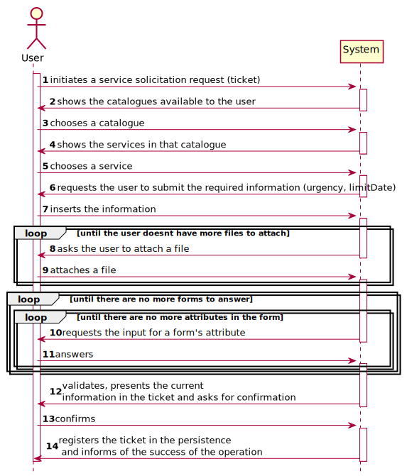
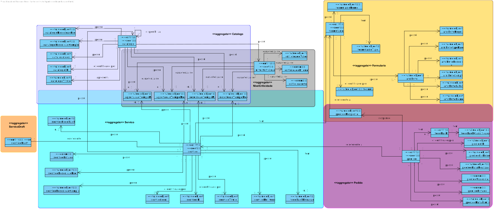
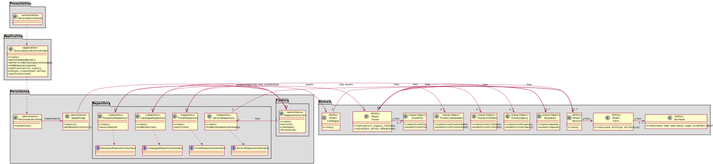

# [US-2-3002] Service Solicitation
=======================================

# 1. Requisitos

**[US-2-3002]** Como utilizador, eu pretendo solicitar um serviço do catálogo de serviços que me é disponibilizado.

A interpretação feita deste requisito foi no sentido do utilizador solicitar um serviço do catálogo disponível 
(implementado em [US-1-3002] Service Solicitation).

### Formato Completo

#### Ator principal

* Utilizador

#### Partes interessadas e seus interesses

* **Utilizador:** pretende solicitar um serviço disponível no catálogo.

#### Pré-condições

* Existirem serviços em catálogos.

#### Pós-condições

* O serviço solicitado é registado na base e dados.

#### Requisitos especiais

\-

#### Lista de Variações de Tecnologias e Dados

\-

#### Frequência de Ocorrência

\-

#### Questões em aberto

\-

# 2. Análise

### Parte do Modelo de Domínio Relevante para esta User Story

# 3. Design

## 3.1. Realização da Funcionalidade

###	Sequence Diagram

## 3.2. Diagrama de Classes

###	Class Diagram

## 3.3. Padrões Aplicados

* DDD (Domain-Driven Design)

## 3.4. Testes 

**Teste Exemplo:** TO-DO

# 4. Implementação

## 4.1. Bootstrap

\-

## 4.2. Commits Mais Relevantes

* Analysis: c6be90e
* Design: 2414dcb
* Implementation: ee0e1b6
* Review: dbe69f2

# 5. Integração/Demonstração

* Foram realizados esforços constantes para que todas as implementações sejam integradas da forma mais coerente, levando a que programa se apresente coeso. 
Isto foi possível através de imenso planeamento da equipa, reuniões e comunicação constantes.

# 6. Observações

## 6.1. Melhoramentos Futuros

* Melhorar os testes unitários.
* Melhorar a implementação da Resposta do Pedido.

