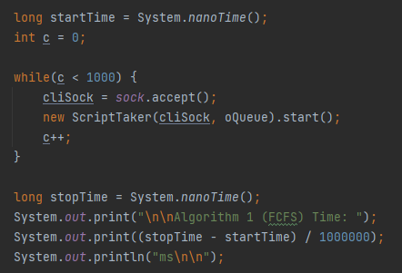
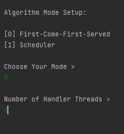
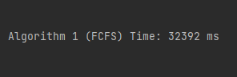
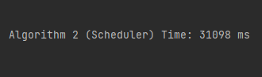
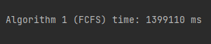
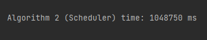

Projeto Integrador LEI 2020-2021 2DI-G03
===========================================

# US-3-4071 - Estudo Comparativo Entre Algoritmos #

## Caso 1 - 1000 Pedidos e 3 Threads ##

### Implementação do Cronómetro ###

* Foi utilizado o método nanoTime() para maior de precisão de resultados. Para além disso, foram enviados 1000 pedidos 
  de execução de tarefa como podemos verificar na figura em baixo.

---

### Número de Handler Threads ###

* Foram definidas 3 handler threads para tratar da execução de tarefas automáticas em simultâneo.

---

### Algoritmo 1 - First Come First Served ###

* Este algoritmo demorou 32392 milissegundos a executar, ou seja, cerca de 32 segundos.

---

### Algoritmo 2 - Scheduler ###

* Ja o segundo algoritmo, demorou 31098 milissegundos a executar (31 segundos).

---

### Conclusões ###

* Podemos concluir que, apesar de muito pequena para 1000 pedidos em simultaneo, existe uma diferença entre os dois algoritmos. 
  Esta diferença será muito mais significativa com valores superiores ao testado neste caso, levando a equipa a recomendar o uso do segundo algoritmo
  pois no que toca a tratar de grandes quantidades de informação, este demorará significativamente menos tempo que o FCFS.
  
---

## Caso 1 - 1000 Pedidos e 3 Threads ##

### Implementação do Cronómetro ###

* A implementação do cronómetro foi similar ao caso 1.

---

### Número de Handler Threads ###

* À semelhança do caso 1 e para melhor comparação de resultados entre casos, foram definidas 3 handler threads para tratar
  da execução de tarefas automáticas em simultâneo.

---

### Algoritmo 1 - First Come First Served ###

* O primeiro algoritmo demorou 1399110 milissegundos a executar (23 minutos e 19 segundos).

---

### Algoritmo 2 - Scheduler ###

* Este algoritmo demorou 1048750 milissegundos a executar, ou seja, cerca de 17 minutos e 28 segundos.

---

### Conclusões ###

* Como tinhamos mencionado anteriormente, com o aumento do tempo, tambem aumenta exponencialemente a diferença entre os algoritmos.