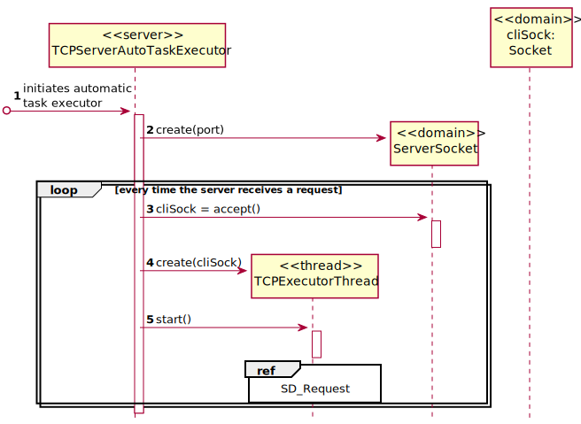
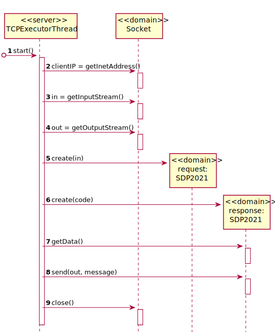

# [US-4-5001] Dashboard
=======================================

# 1. Requisitos

**[US-4-5001]** [US-4-5001] Como Gestor de Projeto, eu pretendo que seja desenvolvido o Executor de Tarefas Automáticas.

# 2. Design

## 2.1. Sequence Diagram - Server

## 2.2. Sequence Diagram - Request

## 2.3. Protocols Used

* SDP2021

# 3. Implementação

## 3.1. Commits Mais Relevantes
* Server: c9aacaa
* Thread: 096f94a

# 4. Integração/Demonstração

* Foram realizados esforços constantes para que todas as implementações sejam integradas da forma mais coerente, levando a que programa se apresente coeso.
  Isto foi possível através de imenso planeamento da equipa, reuniões e comunicação constantes.

# 5. Observações

## 5.1. Melhoramentos Futuros
\-