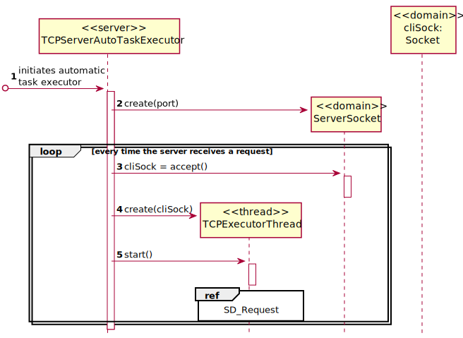
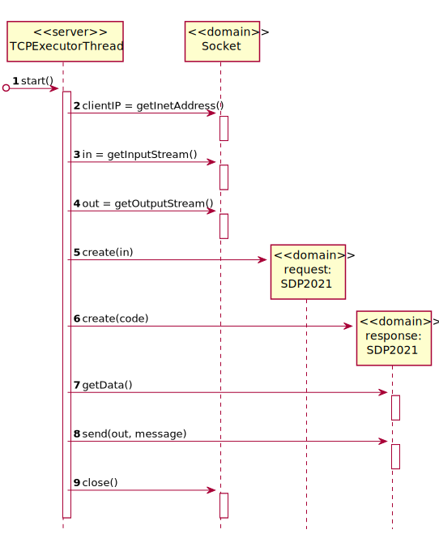

# [US-4-5002] Dashboard
=======================================

# 1. Requisitos

**[US-4-5002]** [US-4-5002] Como Gestor de Projeto, eu pretendo que as comunicações realizadas como aplicação cliente através do protocolo SDP2021 estejam protegidas.

# 2. Design

## 2.1. Sequence Diagram - Server

## 2.2. Sequence Diagram - Request

## 2.3. Protocols Used

* SDP2021
* SSL
* TLS

# 3. Implementação

## 3.1. Commits Mais Relevantes

* Analysis:
* Design: bbef0c8
* Implementation: 7b5fe60
* Review:

# 4. Integração/Demonstração

* Foram realizados esforços constantes para que todas as implementações sejam integradas da forma mais coerente, levando a que programa se apresente coeso.
  Isto foi possível através de imenso planeamento da equipa, reuniões e comunicação constantes.

# 5. Observações

## 5.1. Melhoramentos Futuros
\-