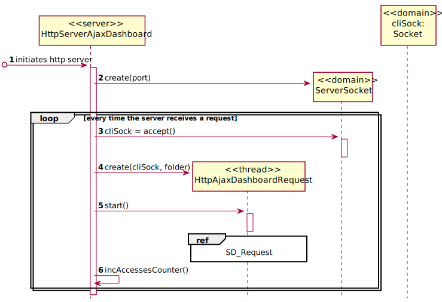

# [US-2-3101] Dashboard SSL
=======================================

# 1. Requisitos

**[US-2-3101]** Aplicar SSL/TLS com autenticação mútua baseada em certificados de chave pública.

# 2. Design

## 2.1. Sequence Diagram - Server

## 2.2. Sequence Diagram - Request

## 2.3. Protocols Used

* SSL
* TLS
* HTTPS
* SDP2021

# 3. Implementação

## 3.1. Commits Mais Relevantes

* Analysis: d2728a4
* Design: c277190
* Implementation: 7d575ba
* Review: 271c2e4

# 4. Integração/Demonstração

* Foram realizados esforços constantes para que todas as implementações sejam integradas da forma mais coerente, levando a que programa se apresente coeso. 
Isto foi possível através de imenso planeamento da equipa, reuniões e comunicação constantes.

# 5. Observações

## 5.1. Melhoramentos Futuros

* Aspeto Gráfico do Dashboard
* Error Handling

