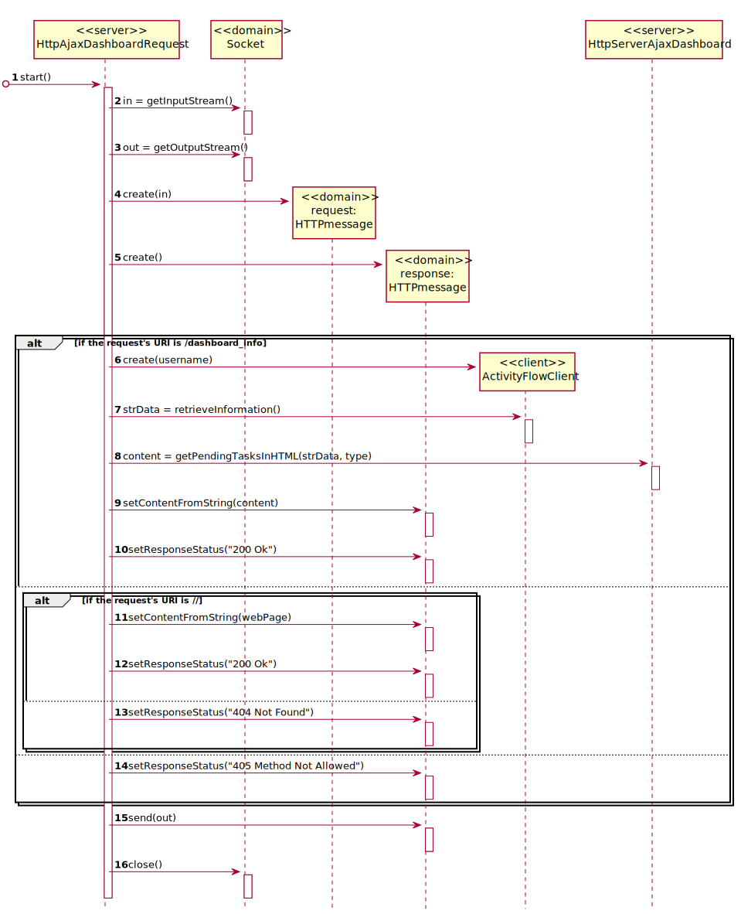

# [US-2-3011] Dashboard
=======================================

# 1. Requisitos

**[US-2-3011]** Como utilizador, eu pretendo que após me autenticar me seja apresentado o meu dashboard web e que este se mantenha atualizado (automaticamente).

# 2. Design

## 2.1. Sequence Diagram - Server

## 2.2. Sequence Diagram - Request

## 2.3. Protocols Used

* HTTP
* SDP2021

# 3. Implementação

## 3.1. Commits Mais Relevantes

* HTML: d3e201a
* JavaScript: 3f9fc0a
* SDP2021 Protocol Development: 63f9eee
* Server: d2728a4
* Thread: 74fd55e
* HTTP: 271c2e4
* Design: 5e047f5

# 4. Integração/Demonstração

* Foram realizados esforços constantes para que todas as implementações sejam integradas da forma mais coerente, levando a que programa se apresente coeso. 
Isto foi possível através de imenso planeamento da equipa, reuniões e comunicação constantes.

# 5. Observações

## 5.1. Melhoramentos Futuros

* Aspeto Gráfico
* Implementação das Conexões do Cliente do Motor de Fluxo de Atividade

